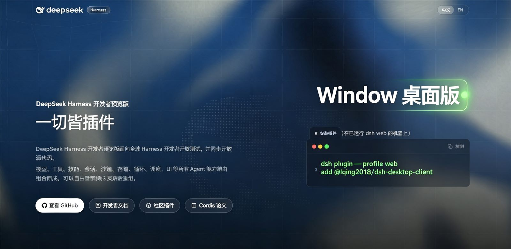

# User Guide

For **regular users**: from download and install to daily use and troubleshooting, step by step. No terminal skills needed.

---

## 1. Download & install

Open the [Releases page](https://github.com/LQing2018/dsh-desktop-client/releases) — under **v0.1.0** there are 2 files:

| File | When to use | Notes |
|---|---|---|
| **`DeepSeek-Harness-Setup.exe`** (~91MB) | Everyday use (recommended) | Single-file installer: double-click → extracts to `%LOCALAPPDATA%\DeepSeek-Harness-Portable` and launches |
| **`DeepSeek-Harness-Portable.zip`** (~113MB) | USB stick / no-install | Portable: unzip anywhere and run |

**Installer edition (Option A)**:

1. Double-click `DeepSeek-Harness-Setup.exe`
2. It silently extracts and opens the client window
3. The whale-icon window = installed

**Portable edition (Option B)**:

1. Right-click the ZIP → "Extract All"
2. Open the `DeepSeek-Harness-Portable` folder
3. Double-click **`DeepSeek Harness.exe`**

> ⚠️ **Requirements**: Windows 10 / 11 (x64) + WebView2 Runtime (bundled with Win11 / latest Edge; [install here](https://developer.microsoft.com/microsoft-edge/webview2/) if missing).
> ⚠️ If antivirus warns, choose "Allow" — the app runs fully locally (only connects to `127.0.0.1`).

---

## 2. First launch (30–60 s, once only)

The first start initializes the local AI service — **please wait**:

1. A loading state may show briefly — normal
2. Once the full interface appears, you're ready

> Every later launch is **instant**.

This is what the window looks like after launch:



---

## 3. Add your model API key (required)

The client ships without keys — add your own:

1. Click the **Settings (gear) icon** in the top-right
2. Open **Models**
3. Add your model (DeepSeek, OpenAI-compatible, etc.) and paste the **API key**
4. Save and go back to chat

> 💡 DeepSeek keys: [platform.deepseek.com](https://platform.deepseek.com). Keys are stored **locally** in `dsh-home` — never uploaded anywhere.

---

## 4. Start using it

- Type in the input box and press Enter
- Switch sessions on the left; long tasks (coding, file analysis) **keep running in the background even after you close the window**
- Settings: models, theme, etc.

---

## 5. Daily management

| What you want | How |
|---|---|
| **Reopen the client** | Desktop shortcut (installer edition) or `DeepSeek Harness.exe` |
| **Close the window** | Click ✕ — **the server keeps running** (background tasks continue) |
| **Stop the server fully** | Open the install folder and double-click **`stop-server.cmd`** |
| **Use another port** | Create `client.json` in the install folder: `{"port": 1234}`, restart the client |
| **Clean / backup data** | Everything lives in the `dsh-home` folder (sessions, keys, settings) — back it up |
| **Move the program** | Copy the whole folder anywhere; **if launch fails after moving, delete `dsh-home` once** and restart (it rebuilds; sessions are cleared) |

---

## 6. Uninstall

- **Installer edition**: delete the whole `%LOCALAPPDATA%\DeepSeek-Harness-Portable` folder
- **Portable edition**: delete the whole unzipped folder
- No registry entries, no startup items left behind

---

## 7. Troubleshooting

| Symptom | Cause & fix |
|---|---|
| **Does it work on Mac?** | ❌ No - Windows only. On macOS use the official Web edition (`npx dsh web` + browser), see the [platform note](../README.en.md) |
| Nothing happens / white screen | ① WebView2 Runtime missing → install it; ② blocked by security software → allow; ③ try another folder |
| First launch takes >2 min | Rare — close the window, run `stop-server.cmd`, reopen the client |
| "Port already in use" | Another program took port 3080 → change it via `client.json` |
| Won't start after moving the folder | Delete `dsh-home` once and restart |
| Want a different key / model | Settings → Models |
| Server keeps running in background | Run `stop-server.cmd` when done |

---

## 8. Use it with the plugin (optional, advanced)

If you run DeepSeek Harness, install the companion plugin so the agent can check/launch the client:

```sh
dsh plugin --profile web add @lqing2018/dsh-desktop-client
```

Then ask the agent:

- *"Is the desktop client installed?"*
- *"Open the desktop client"*

Developer info: [PUBLISH.md](../PUBLISH.md).
